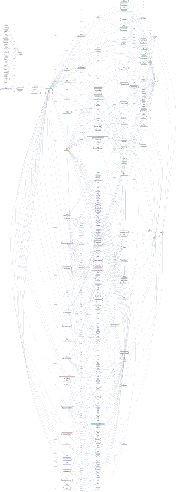

# Sathish Kumar Narayanan

Healthcare Technology Engineer and Technology Lead working across medical device software, digital health, cloud infrastructure, and AI-enabled product development.

My north star is human well-being: building systems that stay close to clinicians, patients, expert users, operators, and communities while moving research and clinical workflows toward usable products.

## Source of Truth

This profile is maintained as a semantic web knowledge graph:

- [RDF/Turtle ontology](rdf/ragavsathish-ontology.ttl)
- [RDF notes](rdf/README.md)

Main identity URI:

```text
https://ragavsathish.github.io/#me
```

## Visualization

The diagram below is generated from the Turtle file.



- [Generated Graphviz DOT](assets/rdf-graph.dot)
- [Generated Mermaid source](assets/rdf-graph.mmd)
- Generate again with `npm run generate:rdf-graph`

## Fit Assistant

Ask fit questions against the RDF profile:

- [Browser-based fit assistant](semantic-web/)

It runs the RDF assessment locally in the browser and can optionally load a small WebGPU LLM for answer wording.

## CV

The human-readable CV lives in LaTeX:

- [cv/main.tex](cv/main.tex)
- [cv/experience.tex](cv/experience.tex)
- [cv/summary.tex](cv/summary.tex)

The GitHub Actions workflow builds the PDF from the TeX files.
